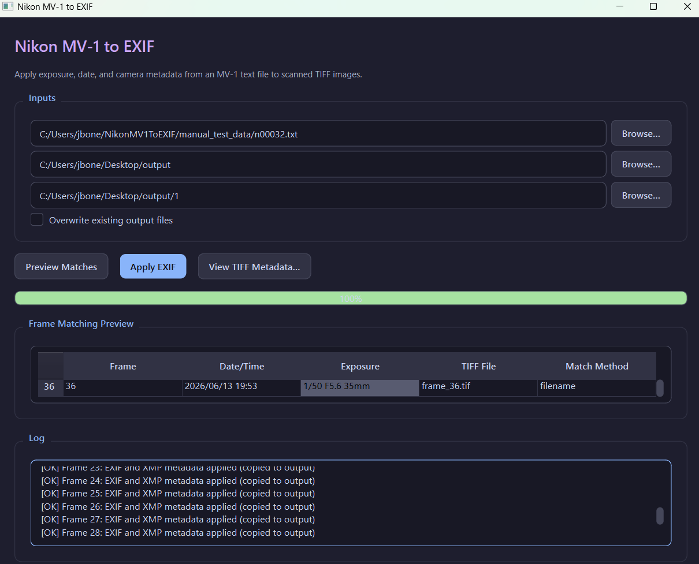

# Nikon MV-1 to EXIF

Apply exposure, date, and camera metadata from a Nikon MV-1 text file to scanned TIFF images.



## Features

- Parse Nikon MV-1 CSV-style metadata files
- Match TIFF scans by frame number in the filename, or by sorted order
- Write standard EXIF tags including date/time, ISO, shutter speed, aperture, and focal length
- Preserve the original TIFF bit depth (8-bit and 16-bit input are supported)
- Modern PyQt6 desktop UI with dark theme
- Synthetic unit tests (no real scan files required)

## Setup

### Using uv (recommended)

```bash
cd NikonMV1ToEXIF
uv sync
uv run nikon-mv1-to-exif
```

The project pins Python 3.12 via `.python-version`. If you previously created a venv with Anaconda Python, delete `.venv` and run `uv sync` again so PyQt6 loads correctly on Windows.

Run tests:

```bash
uv sync --extra dev
uv run pytest
```

### Using pip

```bash
python -m venv .venv
.venv\Scripts\activate
pip install -e ".[dev]"
```

## Run the app

```bash
python -m nikon_mv1_to_exif
```

## Run tests

```bash
pytest
```

## Manual test data

The `manual_test_data/` folder contains a copy of `n00032.txt` and 36 synthetic TIFFs (`frame_01.tif` … `frame_36.tif`) for hands-on testing. See `manual_test_data/README.md` for details.

Regenerate with:

```bash
uv run python scripts/generate_manual_test_data.py
```

## Usage

1. Select your MV-1 `.txt` file (for example `n00032.txt`)
2. Select the folder containing your TIFF scans
3. Optionally choose an output folder (leave empty to update files in place)
4. Click **Preview Matches** to verify frame-to-file mapping
5. Click **Apply EXIF** to write metadata

Use **View TIFF Metadata…** to pick any `.tif`/`.tiff` file and inspect its EXIF and XMP tags in a separate dialog.

## TIFF naming

The app matches MV-1 frame numbers to TIFF filenames when possible. Use `.tif` or `.tiff` extensions.

### Recommended patterns

These names are explicit, easy to preview, and map directly to MV-1 frame numbers:

| Pattern | Examples for frames 1–36 |
|--------|---------------------------|
| `frame_XX` | `frame_01.tif`, `frame_02.tif`, … `frame_36.tif` |
| Zero-padded numbers | `001.tif`, `002.tif`, … `036.tif` |
| Film + frame | `n00032_01.tif`, `n00032_02.tif`, … `n00032_36.tif` |
| Scan prefix | `scan-01.tiff`, `scan-02.tiff`, … `scan-36.tiff` |

For your example MV-1 file (`n00032.txt`, film 32, 36 frames), a well-structured folder looks like:

```text
scans/
  frame_01.tif   → MV-1 frame 01
  frame_02.tif   → MV-1 frame 02
  ...
  frame_36.tif   → MV-1 frame 36
```

Or:

```text
scans/
  n00032_01.tif
  n00032_02.tif
  ...
  n00032_36.tif
```

### Other supported patterns

The matcher also recognizes:

- `frame02.tif`, `frame-02.tif`, `frm_02.tif`, `img_02.tif`
- `02.tif`, `002.tiff`, `24.tif`, `scan_24.tif`
- Trailing frame numbers after a separator: `rollA_12.tif`, `contact_05.tif`

Leading zeros are fine — `frame_01`, `frame_1`, and `001` all match MV-1 frame 1.

### Fallback: alphabetical order

If filenames contain no frame number (for example `DSC0001.tif`, `photo.tif`), files are matched in **alphabetical order** to MV-1 frame order. Frame 1 → first file, frame 2 → second file, and so on.

Only use this when scan order and MV-1 frame order are the same. For safer matching, include the frame number in each filename.

### Patterns to avoid

- Identical names with no frame hint: `scan.tif`, `image.tif`
- Gaps or mismatched numbering: MV-1 frame 5 mapped to a file named `frame_09.tif`
- Mixed schemes in one folder: some `frame_01.tif` and others only sortable by name

## EXIF tags written

- `DateTime`, `DateTimeOriginal`, `DateTimeDigitized`
- `Make`, `Model`, `ImageDescription`
- `ISOSpeedRatings` (from film speed)
- `ExposureTime`, `FNumber`, `FocalLength`
- `ExposureBiasValue`, `MaxApertureValue`
- `MeteringMode`, `ExposureMode`, `Flash`
- `UserComment` with additional MV-1 fields

## XMP tags written

Each MV-1 CSV column is also written to its own XMP tag in the custom namespace `NMV1` (`http://nikonmv1toexif/1.0/`):

| MV-1 column | XMP tag |
|-------------|---------|
| Film speed | `Xmp.NMV1.FilmSpeed` |
| Film number | `Xmp.NMV1.FilmNumber` |
| Camera ID | `Xmp.NMV1.CameraID` |
| Frame number | `Xmp.NMV1.FrameNumber` |
| Shutter speed | `Xmp.NMV1.ShutterSpeed` |
| Aperture | `Xmp.NMV1.Aperture` |
| Focal length | `Xmp.NMV1.FocalLength` |
| Lens maximum aperture | `Xmp.NMV1.LensMaximumAperture` |
| Metering system | `Xmp.NMV1.MeteringSystem` |
| Exposure mode | `Xmp.NMV1.ExposureMode` |
| Flash sync mode | `Xmp.NMV1.FlashSyncMode` |
| Exposure compensation value | `Xmp.NMV1.ExposureCompensationValue` |
| EV difference in Manual | `Xmp.NMV1.EVDifferenceInManual` |
| Flash exposure compensation value | `Xmp.NMV1.FlashExposureCompensationValue` |
| Speedlight setting | `Xmp.NMV1.SpeedlightSetting` |
| Multiple exposure | `Xmp.NMV1.MultipleExposure` |
| Lock | `Xmp.NMV1.Lock` |
| Vibration Reduction | `Xmp.NMV1.VibrationReduction` |
| Date(yy/mm/dd) | `Xmp.NMV1.Date` |
| Time | `Xmp.NMV1.Time` |

Inspect with ExifTool, for example:

```bash
exiftool -Xmp.NMV1:all frame_01.tif
```
